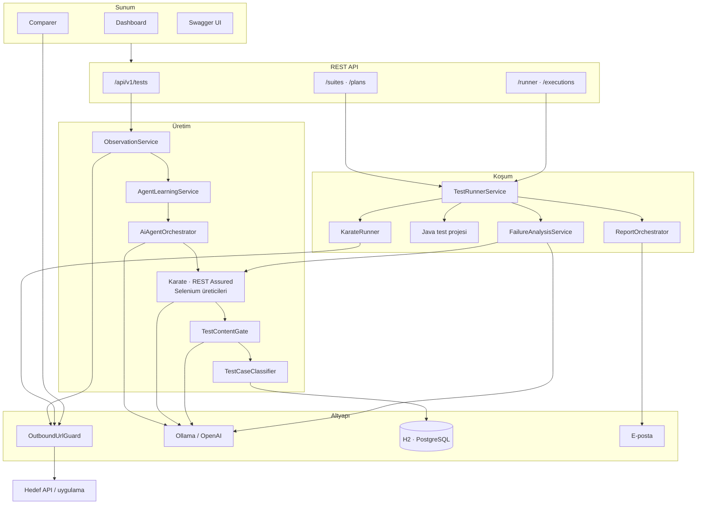
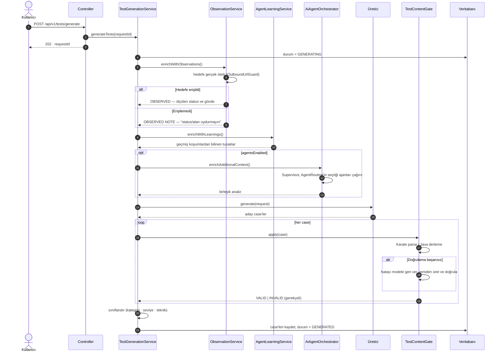
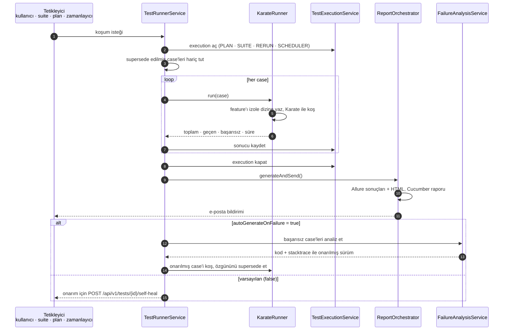
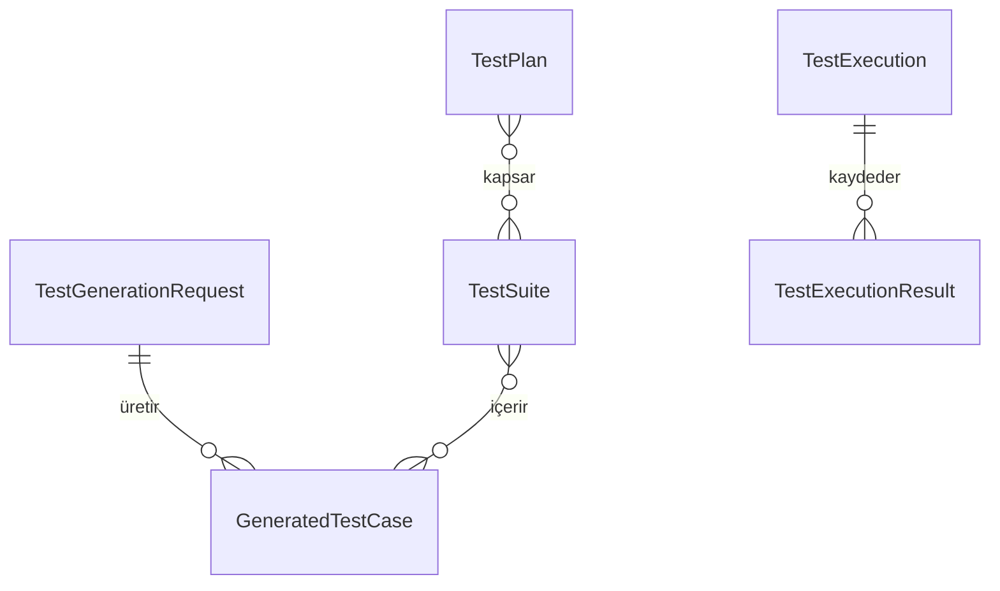

<div align="center">

# AI Test Generator

**API sözleşmenizden ISTQB standartlarında, çalıştırılabilir test paketi.**

Swagger · Postman · HAR · GraphQL · WSDL → Karate DSL · REST Assured · Selenium

[](#teknoloji-yığını)
[](#teknoloji-yığını)
[](#kalite-kapıları)
[](#kalite-kapıları)

[English README](README_EN.md)

</div>


---

## Hangi problemi çözer

**Test tasarımı kişiye bağlıdır.** Aynı endpoint'i iki mühendis farklı kapsamda test eder; negatif ve
sınır senaryolar çoğu zaman ilk elenenlerdir. Platform senaryoları ISTQB test tasarım tekniklerine
göre türetir ve her senaryoyu `[KATEGORİ][ÖNCELİK][TEKNİK]` etiketiyle işaretler — hangi senaryonun
hangi gerekçeyle var olduğu izlenebilir.

**Üretilen test, koşmadan güvenilmez.** Üretim çıktısı veritabanına yazılmadan önce makineyle
doğrulanır: Karate feature'ı ayrıştırılır, Java kodu derlenir. Geçemeyen içerik `INVALID` olarak
gerekçesiyle işaretlenir; hata koşum sırasında değil üretim sırasında görünür olur.

**Testler sözleşme değişince çürür.** Başarısız test, hata çıktısıyla birlikte dil modeline geri
verilerek onarılabilir; onarılmış sürüm özgün case'in yerini alır.

**Üretilmiş içerik doğrulanabilir olmalıdır.** Hedefe erişilebiliyorsa testler tahmine değil ölçülen
yanıta dayanır. Erişilemiyorsa sistem varsayılan bir status veya adres üretmez — üretimi durdurur ve
nedenini bildirir. Bu davranış `NoFabricatedContentTest` ile derlemeye bağlıdır.

---

## Hızlı başlangıç

Önkoşul: Docker Desktop ve Git. Ollama kurulu değilse `setup.sh` kurar.

```bash
git clone https://github.com/onurkavutlu/ai-test-generator.git
cd ai-test-generator && cp .env.example .env
chmod +x setup.sh && ./setup.sh
```

Uygulama, PostgreSQL, MailHog, Allure, Selenium Grid, Prometheus, Grafana ve pgAdmin ayağa kalkar.
Dashboard: **http://localhost:8080**

Üretimi komut satırından tetiklemek için:

```bash
./trigger-generation.sh --swagger <openapi-url> --framework KARATE --run
```

Betik hedef sözleşmeye erişilebildiğini doğrulamadan üretimi başlatmaz; erişilemiyorsa nedenini
bildirip durur.

<details>
<summary><b>Docker kullanmadan yerel kurulum</b></summary>

Yalnızca uygulama çalışır; veri dosya tabanlı H2'de (`java.io.tmpdir` altında) tutulur.
Java 17+ gerekir, Maven gerekmez.

```bash
chmod +x kurulum.sh && ./kurulum.sh     # yokla, kur, başlat
./kurulum.sh --check                    # yalnızca ortamı yokla
./mvnw spring-boot:run -Dspring-boot.run.profiles=local
```
</details>

---

## Üretilen test neye benzer

```gherkin
Feature: User Authentication API

  Background:
    * url baseUrl
    * configure connectTimeout = 10000
    * def validUser   = { username: 'testuser@example.com', password: 'Test@123' }
    * def invalidUser = { username: 'wrong@example.com',    password: 'WrongPass' }

  Scenario: POST /auth/login - Geçerli kimlik bilgileriyle başarılı giriş
    Given path '/auth/login'
    And request validUser
    When method POST
    Then status 200
    And match response.token == '#notnull'
    And match response.expiresIn == '#number'
    And match response.user.email == validUser.username

  Scenario: POST /auth/login - Hatalı şifreyle 401 dönmeli
    Given path '/auth/login'
    And request invalidUser
    When method POST
    Then status 401
    And match response.error == '#notnull'
```

Tam örnekler: [`docs/example-generated-test.feature`](docs/example-generated-test.feature) ·
[`docs/example-selenium-generated.java`](docs/example-selenium-generated.java)

---

## Nasıl çalışır

### Sistem mimarisi



### Üretim akışı

Aşağıdaki sıra `TestGenerationService.generateTests` gövdesindeki gerçek çağrı sırasıdır.



### Koşum ve onarım akışı



**Self-healing varsayılan olarak otomatik değildir.** `autoGenerateOnFailure` varsayılanı `false`;
onarım `POST /api/v1/tests/{id}/self-heal` ile başlatılır. Bir case en fazla `max-heal-attempts`
(varsayılan 3) kez onarılır, tek turda en fazla `MAX_HEAL_BATCH` (varsayılan 10) case işlenir.

### Test varlıkları



Case'ler test paketlerinde, paketler test planlarında toplanır. Her koşum bir `TestExecution` kaydı
oluşturur ve tetikleyicisi saklanır. Zamanlanmış koşum `scheduler.daily-run.cron` ifadesine göre
çalışır (varsayılan: her gün 02:00).

### Ajan yönlendirme

Sekiz ajan rolü tanımlıdır; bir istekte hepsi koşmaz. Koşacak ajanlar `AgentRouting` tarafından test
tipine ve moda göre seçilir.

| Ajan | Sorumluluk | LEAN (varsayılan) | FULL |
|---|---|:---:|:---:|
| Product Manager | İş riski, kabul kriterleri | hikâye varsa | ✓ |
| Developer | Teknik inceleme, veri ve kısıt kuralları | API testinde | ✓ |
| Test Analyst | ISTQB test stratejisi | ✓ | ✓ |
| Test Automation | Çalıştırılabilir koda dönüştürme | ✓ | ✓ |
| SecOps | Güvenlik senaryosu kuralları | API testinde | ✓ |
| Performance | SLA ve yük gereksinimleri | — | ✓ |
| Report | Konsolidasyon, yönetici özeti | — | ✓ |

Mod `AGENT_MODE` ile belirlenir. Supervisor rolleri tool calling ile çağırır; model bunu
desteklemiyorsa sıralı yedek akışa geçilir — bu durumda da hazır metin üretilmez, cevap alınamayan
ajanın analizi boş kalır.

---

## CI/CD entegrasyonu

`jenkins/Jenkinsfile` uçtan uca bir hat tanımlar; test üretimi hattın bir aşamasıdır:

```
Checkout → Secret Scan (Trivy) → Build & Unit Tests (mvn verify)
        → Dependency Scan (OWASP) → SonarQube → Docker Build
        → Container Scan → OCP Registry → Deploy to Dev
        → Smoke Tests → Regression → AI Test Generation → AI Testlerini Koş
```

`AI Test Generation` aşaması, dağıtılmış uygulamanın kendi `/v3/api-docs` çıktısını kullanarak
`POST /api/v1/tests/generate` çağırır; üretilen Karate ve Selenium testleri sonraki aşamada koşulur.
Kubernetes/OpenShift bildirimleri `k8s/` altındadır.

---

## Güvenlik

Platform, kullanıcı tarafından verilen adreslere istek gönderdiği için doğası gereği SSRF yüzeyi
taşır. Dışarıya çıkan tüm istekler `OutboundUrlGuard` üzerinden geçer:

- Bulut metadata uçları her koşulda reddedilir.
- DNS rebinding'e karşı, ana makine adının çözümlenen tüm adresleri denetlenir.
- Yönlendirmeler otomatik izlenmez; her adım yeniden denetlenerek takip edilir.
- Loopback ve özel ağlara varsayılan olarak izin verilir; iç servis testi birincil kullanım
  senaryosudur. Çok kiracılı dağıtımlarda
  `test-generator.security.allow-private-networks: false` ile kapatılır.


---

## Kalite kapıları

`./mvnw verify` aşağıdaki kapıların tamamını koşar; biri karşılanmazsa derleme başarısız olur.

| Kapı | Eşik | Son ölçüm |
|---|---|---|
| Testler | 0 hata | 539 test — 527 koştu ve geçti, 12 atlandı |
| Satır kapsamı | ≥ %72 | %75.2 |
| Dal kapsamı | ≥ %58 | %60.9 |
| Sahte içerik denetimi | — | `NoFabricatedContentTest` |

Atlanan senaryolar, hedef API'ye erişilemeyen ortamlarda kendini atlayan uçtan uca testlerdir; ağ
erişimi bulunan ortamlarda koşarlar. Güncel ölçüm: `./mvnw verify` sonrası
`target/site/jacoco/index.html`.

---

## Teknoloji yığını

| Katman | Teknoloji | Sürüm |
|---|---|---|
| Çalışma zamanı | Java · Spring Boot | 17 · 3.5.4 |
| LLM altyapısı | LangChain4j | 0.34.0 |
| Model sağlayıcı | Ollama (`llama3.1`) · OpenAI | — |
| API test üretimi | Karate DSL · REST Assured | 1.5.2 · 5.4.0 |
| Web test üretimi | Selenium WebDriver | 4.18.1 |
| Senaryo ve raporlama | Cucumber · Allure | 7.15.0 · 2.24.0 |
| Veri | H2 · PostgreSQL · Spring Data JPA | — |
| Kalite | JUnit 5 · Mockito · JaCoCo | 0.8.11 |
| İzleme | Micrometer · Prometheus · Grafana | — |
| Dağıtım | Docker · Kubernetes / OpenShift · Jenkins | — |

LangChain4j 0.34.0'a sabitlenmiştir: Ollama üzerinden tool calling bu sürümde beklendiği gibi
çalışmakta olup Supervisor orkestrasyonu bu yeteneğe bağlıdır.

<details>
<summary><b>Proje kırılımı</b></summary>

```
src/main/java/com/testgen/
├── agent/        16  Ajan rolleri, Supervisor, AgentRouting, ajan araçları
├── comparer/      9  Endpoint Comparer — JSON diff, yanıt farkı ajanı
├── config/        5  OutboundUrlGuard, LLM yapılandırması, Swagger, hata yönetimi
├── controller/   14  REST uçları
├── generator/    11  Üreticiler, TestContentGate, doğrulayıcı, sınıflandırıcı
├── llm/           7  Ollama ve OpenAI servisleri, çağrı geçmişi, prompt şablonları
├── metrics/       1  Micrometer metrikleri
├── model/        26  Alan modeli ve enum'lar
├── notification/  2  E-posta bildirimi
├── parser/        6  Swagger · Postman · HAR · GraphQL · SOAP ayrıştırıcıları
├── report/        6  Cucumber ve Allure rapor üretimi
├── repository/   12  JPA repository'leri
├── runner/        9  Derleme, koşum, iddia derleyici, direkt istek servisi
├── scheduler/     3  Zamanlanmış koşum ve hata analizi
└── service/      11  Orkestrasyon, üretim, gözlem, plan ve paket servisleri
```
</details>

<details>
<summary><b>Yapılandırma ve API uçları</b></summary>

| Değişken | Varsayılan | Açıklama |
|---|---|---|
| `LLM_PROVIDER` | `ollama` | `ollama` veya `openai` |
| `OLLAMA_MODEL` | `llama3.1` | Tool calling destekleyen model önerilir |
| `OPENAI_API_KEY` | — | `LLM_PROVIDER=openai` için zorunlu |
| `AGENT_MODE` | `LEAN` | Ajan yönlendirme modu (`LEAN` · `FULL`) |
| `MAX_HEAL_BATCH` | `10` | Tek onarım turunda işlenecek azami case sayısı |
| `EMAIL_RECIPIENTS` | — | Koşum sonrası bildirim alıcıları |

Tam API referansı Swagger UI üzerindedir: `http://localhost:8080/swagger-ui/index.html`

| Uç | HTTP | Açıklama |
|---|---|---|
| `/api/v1/tests/generate` | POST | Üretim başlatır (asenkron) |
| `/api/v1/tests/{id}` | GET | `PENDING` · `GENERATING` · `GENERATED` · `FAILED` |
| `/api/v1/tests/{id}/cases` | GET · POST | Case listesi; POST ile elle yazılmış case eklenir |
| `/api/v1/tests/{id}/run-all` | POST | Derler ve koşar |
| `/api/v1/tests/{id}/self-heal` | POST | Onarım turu başlatır |
| `/api/v1/tests/{id}/llm-report` | GET | Ajan analizleri |
| `/api/v1/suites` · `/api/v1/plans` | GET · POST | Paketler ve planlar |
| `/api/v1/executions` | GET | Koşum geçmişi |
| `/api/v1/runner/execute` | POST | Tek isteği canlı koşar |
| `/api/v1/comparison/run` | POST | İki ortamı karşılaştırır |
| `/api/v1/llm/summary` | GET | LLM çağrı istatistikleri |

Arayüzler: `:8080` dashboard · `:8080/comparer` comparer · `:8025` MailHog · `:8888` Allure ·
`:4444` Selenium Grid · `:9090` Prometheus · `:3000` Grafana · `:5050` pgAdmin
</details>

---

## Belgeler

- [Üretilmiş Karate örneği](docs/example-generated-test.feature)
- [Üretilmiş Selenium örneği](docs/example-selenium-generated.java)
- [IntelliJ'de Karate testi koşma](docs/intellij-karate-run.md)
- Ekran görüntüleri: [`docs/ekran-goruntuleri/`](docs/ekran-goruntuleri/)

## Katkı

Commit mesajları [Conventional Commits](https://www.conventionalcommits.org/) biçimindedir. Davranış
değişiklikleri test ile birlikte gönderilir; kapsam kapısı karşılanmadığında derleme başarısız olur.
Ölçülemeyen bir değeri üreten katkılar kabul edilmez.
