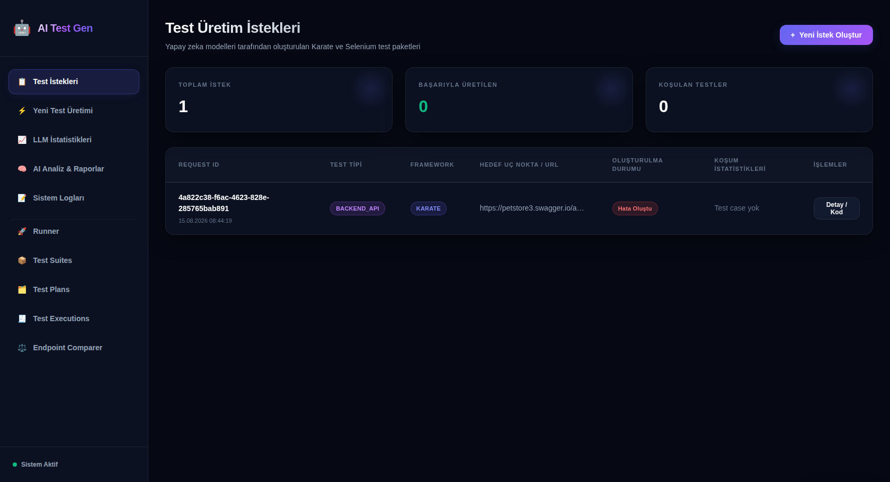
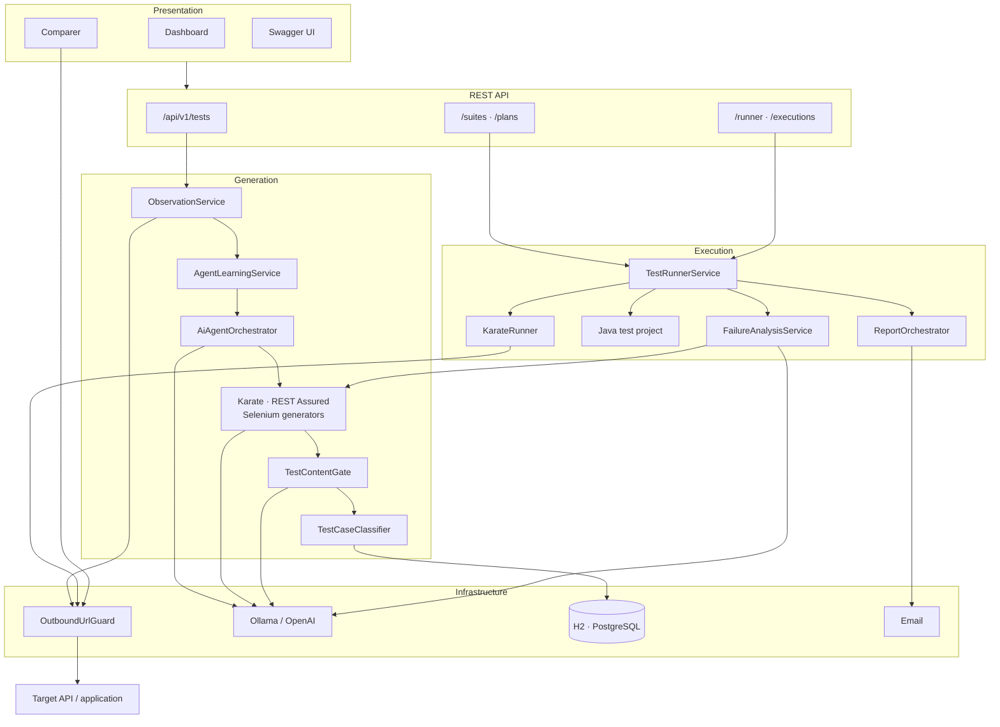
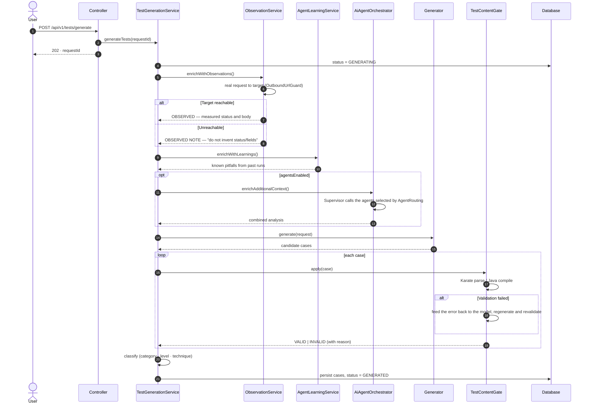
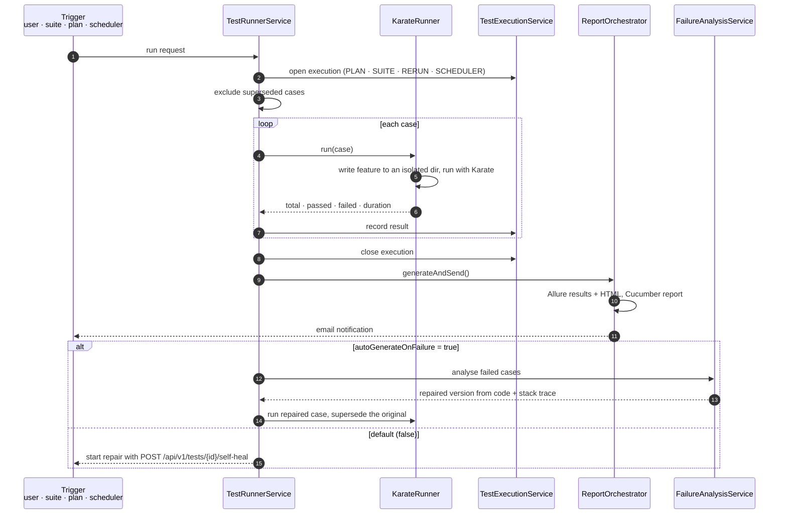
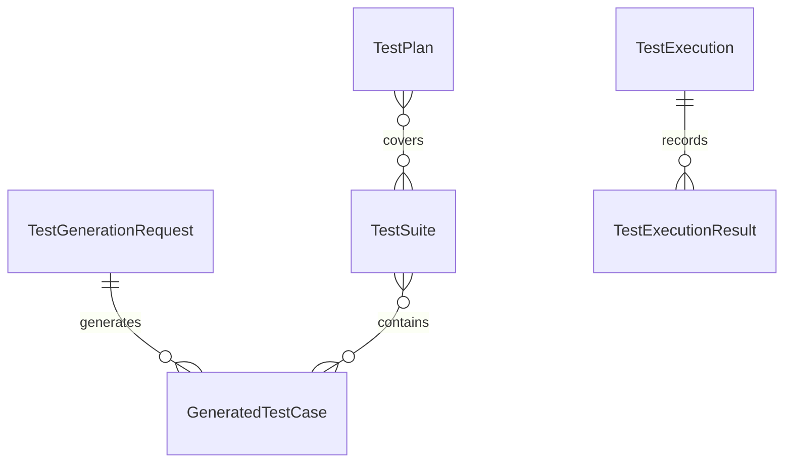
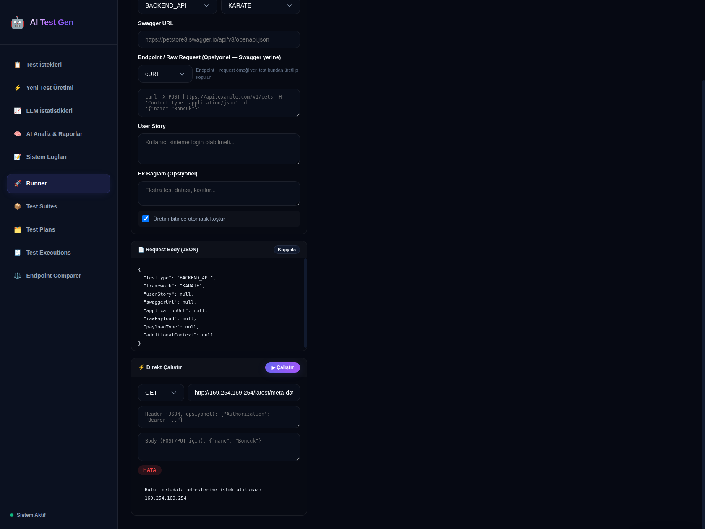

<div align="center">

# AI Test Generator

**From your API contract to an executable, ISTQB-grade test suite.**

Swagger · Postman · HAR · GraphQL · WSDL → Karate DSL · REST Assured · Selenium

[](#technology-stack)
[](#technology-stack)
[](#quality-gates)
[](#quality-gates)

[Türkçe README](README.md)

</div>



---

## What problem does it solve

**Test design depends on who writes it.** Two engineers cover the same endpoint differently, and
negative or boundary scenarios are usually the first to be dropped. The platform derives scenarios
from ISTQB test design techniques and tags each one `[CATEGORY][PRIORITY][TECHNIQUE]`, so the
engineering rationale behind every scenario stays traceable.

**A generated test is worthless until it runs.** Output is machine-validated before it reaches the
database: Karate features are parsed, Java code is compiled. Content that fails is stored as
`INVALID` with its reason — the error surfaces at generation time instead of during a run.

**Tests rot when the contract changes.** A failing test can be sent back to the model together with
its stack trace and repaired; the repaired version supersedes the original case.

**Generated content must be verifiable.** When the target is reachable, tests are based on the
measured response rather than a guess. When it is not, the system does not invent a default status
or address — it stops generation and reports why. This behaviour is enforced by
`NoFabricatedContentTest`.

---

## Quick start

Prerequisites: Docker Desktop and Git. If Ollama is not installed, `setup.sh` installs it.

```bash
git clone https://github.com/onurkavutlu/ai-test-generator.git
cd ai-test-generator && cp .env.example .env
chmod +x setup.sh && ./setup.sh
```

The application, PostgreSQL, MailHog, Allure, Selenium Grid, Prometheus, Grafana and pgAdmin start
together. Dashboard: **http://localhost:8080**

To trigger generation from the command line:

```bash
./trigger-generation.sh --swagger <openapi-url> --framework KARATE --run
```

The script will not start generation before verifying that the target contract is reachable; if it
is not, it stops and reports the reason.

<details>
<summary><b>Local setup without Docker</b></summary>

Only the application runs; data is kept in a file-based H2 database (under `java.io.tmpdir`).
Java 17+ is required, Maven is not.

```bash
chmod +x kurulum.sh && ./kurulum.sh     # probe, install, start
./kurulum.sh --check                    # probe the environment only
./mvnw spring-boot:run -Dspring-boot.run.profiles=local
```
</details>

---

## What generated tests look like

```gherkin
Feature: User Authentication API

  Background:
    * url baseUrl
    * configure connectTimeout = 10000
    * def validUser   = { username: 'testuser@example.com', password: 'Test@123' }
    * def invalidUser = { username: 'wrong@example.com',    password: 'WrongPass' }

  Scenario: POST /auth/login - successful login with valid credentials
    Given path '/auth/login'
    And request validUser
    When method POST
    Then status 200
    And match response.token == '#notnull'
    And match response.expiresIn == '#number'
    And match response.user.email == validUser.username

  Scenario: POST /auth/login - wrong password must return 401
    Given path '/auth/login'
    And request invalidUser
    When method POST
    Then status 401
    And match response.error == '#notnull'
```

Full examples: [`docs/example-generated-test.feature`](docs/example-generated-test.feature) ·
[`docs/example-selenium-generated.java`](docs/example-selenium-generated.java)

---

## How it works

### System architecture



### Generation flow

The sequence below is the actual call order inside `TestGenerationService.generateTests`.



### Execution and repair flow



**Self-healing is not automatic by default.** `autoGenerateOnFailure` defaults to `false`; repair is
started with `POST /api/v1/tests/{id}/self-heal`. A case is repaired at most `max-heal-attempts`
times (default 3), and at most `MAX_HEAL_BATCH` cases (default 10) are processed per round.

### Test entities



Cases are grouped into test suites and suites into test plans. Every run creates a `TestExecution`
record together with its trigger. Scheduled runs follow the `scheduler.daily-run.cron` expression
(default: daily at 02:00).

### Agent routing

Eight agent roles are defined; not all of them run for a given request. `AgentRouting` selects the
agents based on test type and mode.

| Agent | Responsibility | LEAN (default) | FULL |
|---|---|:---:|:---:|
| Product Manager | Business risk, acceptance criteria | if user story present | ✓ |
| Developer | Technical review, data and constraint rules | for API tests | ✓ |
| Test Analyst | ISTQB test strategy | ✓ | ✓ |
| Test Automation | Conversion into executable code | ✓ | ✓ |
| SecOps | Security scenario rules | for API tests | ✓ |
| Performance | SLA and load requirements | — | ✓ |
| Report | Consolidation, executive summary | — | ✓ |

The mode is set with `AGENT_MODE`. A Supervisor invokes the roles via tool calling; if the model does
not support it, a sequential fallback is used — and even then no canned text is produced: an agent
that cannot answer simply leaves its analysis empty.

---

## CI/CD integration

`jenkins/Jenkinsfile` defines an end-to-end pipeline in which test generation is one of the stages:

```
Checkout → Secret Scan (Trivy) → Build & Unit Tests (mvn verify)
        → Dependency Scan (OWASP) → SonarQube → Docker Build
        → Container Scan → OCP Registry → Deploy to Dev
        → Smoke Tests → Regression → AI Test Generation → Run AI Tests
```

The `AI Test Generation` stage calls `POST /api/v1/tests/generate` using the deployed application's
own `/v3/api-docs` output; the generated Karate and Selenium tests are executed in the following
stage. Kubernetes/OpenShift manifests live under `k8s/`.

---

## Security

Because the platform sends requests to user-supplied addresses, it is inherently an SSRF surface.
All outbound requests pass through `OutboundUrlGuard`:

- Cloud metadata endpoints are rejected unconditionally.
- Against DNS rebinding, every resolved address of a hostname is checked — not only the first.
- Redirects are not followed automatically; each hop is re-validated as it is followed.
- Loopback and private networks are allowed by default, since testing internal services is the
  primary use case. In multi-tenant deployments, disable with
  `test-generator.security.allow-private-networks: false`.



---

## Quality gates

`./mvnw verify` runs every gate below; the build fails if any of them is not met.

| Gate | Threshold | Last measurement |
|---|---|---|
| Tests | 0 failures | 539 tests — 527 ran and passed, 12 skipped |
| Line coverage | ≥ 72% | 75.2% |
| Branch coverage | ≥ 58% | 60.9% |
| Fabricated-content check | — | `NoFabricatedContentTest` |

The skipped scenarios are end-to-end tests that skip themselves where the target API is unreachable;
they run in environments with network access. For a current measurement, run `./mvnw verify` and open
`target/site/jacoco/index.html`.

---

## Technology stack

| Layer | Technology | Version |
|---|---|---|
| Runtime | Java · Spring Boot | 17 · 3.5.4 |
| LLM infrastructure | LangChain4j | 0.34.0 |
| Model providers | Ollama (`llama3.1`) · OpenAI | — |
| API test generation | Karate DSL · REST Assured | 1.5.2 · 5.4.0 |
| Web test generation | Selenium WebDriver | 4.18.1 |
| Scenarios and reporting | Cucumber · Allure | 7.15.0 · 2.24.0 |
| Data | H2 · PostgreSQL · Spring Data JPA | — |
| Quality | JUnit 5 · Mockito · JaCoCo | 0.8.11 |
| Observability | Micrometer · Prometheus · Grafana | — |
| Deployment | Docker · Kubernetes / OpenShift · Jenkins | — |

LangChain4j is pinned to 0.34.0: tool calling over Ollama behaves as expected in this version, and
Supervisor orchestration depends on that capability.

<details>
<summary><b>Project breakdown</b></summary>

```
src/main/java/com/testgen/
├── agent/        16  Agent roles, Supervisor, AgentRouting, agent tools
├── comparer/      9  Endpoint Comparer — JSON diff, response-diff agent
├── config/        5  OutboundUrlGuard, LLM configuration, Swagger, error handling
├── controller/   14  REST endpoints
├── generator/    11  Generators, TestContentGate, validator, classifier
├── llm/           7  Ollama and OpenAI services, call history, prompt templates
├── metrics/       1  Micrometer metrics
├── model/        26  Domain model and enums
├── notification/  2  Email notification
├── parser/        6  Swagger · Postman · HAR · GraphQL · SOAP parsers
├── report/        6  Cucumber and Allure report generation
├── repository/   12  JPA repositories
├── runner/        9  Build, run, assertion compiler, direct request service
├── scheduler/     3  Scheduled runs and failure analysis
└── service/      11  Orchestration, generation, observation, plan and suite services
```
</details>

<details>
<summary><b>Configuration and API endpoints</b></summary>

| Variable | Default | Description |
|---|---|---|
| `LLM_PROVIDER` | `ollama` | `ollama` or `openai` |
| `OLLAMA_MODEL` | `llama3.1` | A model with tool calling support is recommended |
| `OPENAI_API_KEY` | — | Required when `LLM_PROVIDER=openai` |
| `AGENT_MODE` | `LEAN` | Agent routing mode (`LEAN` · `FULL`) |
| `MAX_HEAL_BATCH` | `10` | Maximum cases processed in one repair round |
| `EMAIL_RECIPIENTS` | — | Notification recipients after a run |

The full API reference is served by Swagger UI: `http://localhost:8080/swagger-ui/index.html`

| Endpoint | HTTP | Description |
|---|---|---|
| `/api/v1/tests/generate` | POST | Starts generation (asynchronous) |
| `/api/v1/tests/{id}` | GET | `PENDING` · `GENERATING` · `GENERATED` · `FAILED` |
| `/api/v1/tests/{id}/cases` | GET · POST | Case list; POST adds a hand-written case |
| `/api/v1/tests/{id}/run-all` | POST | Builds and runs |
| `/api/v1/tests/{id}/self-heal` | POST | Starts a repair round |
| `/api/v1/tests/{id}/llm-report` | GET | Agent analyses |
| `/api/v1/suites` · `/api/v1/plans` | GET · POST | Suites and plans |
| `/api/v1/executions` | GET | Run history |
| `/api/v1/runner/execute` | POST | Runs a single request live |
| `/api/v1/comparison/run` | POST | Compares two environments |
| `/api/v1/llm/summary` | GET | LLM call statistics |

Interfaces: `:8080` dashboard · `:8080/comparer` comparer · `:8025` MailHog · `:8888` Allure ·
`:4444` Selenium Grid · `:9090` Prometheus · `:3000` Grafana · `:5050` pgAdmin
</details>

---

## Documentation

- [Generated Karate example](docs/example-generated-test.feature)
- [Generated Selenium example](docs/example-selenium-generated.java)
- [Running Karate tests in IntelliJ](docs/intellij-karate-run.md)
- Screenshots: [`docs/ekran-goruntuleri/`](docs/ekran-goruntuleri/)

## Contributing

Commit messages follow [Conventional Commits](https://www.conventionalcommits.org/). Behavioural
changes ship with tests; the build fails when the coverage gate is not met. Contributions that
produce values which cannot be measured are not accepted.
